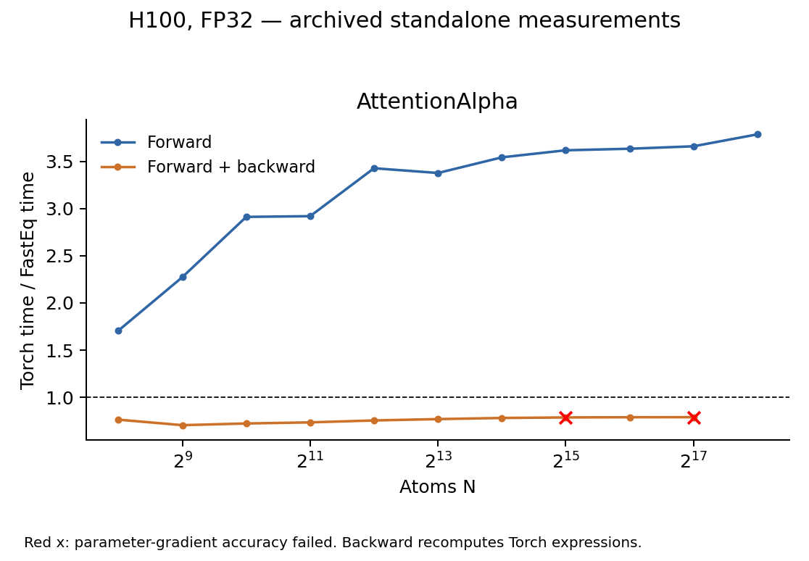

# AttentionAlpha performance

Forward is faster in the measured sweep. Forward + backward is slower, and
two large-N parameter-gradient checks fail. Those failing backward timings
are retained as diagnostic data.

## Test scope and correctness

The tested [fused_atten_alpha](../fasteq/triton/fused_attention_alpha.py) is
compared with the original EQv3 attention expressions from
`EquivariantGraphAttention.forward`: Torch LayerNorm, native SmoothLeakyReLU,
dropout and the weighted channel sum. The benchmark runs that operator block,
not the complete attention module or model.

Inputs are `[E, 8, 32]`, `E=32N`; dropout is disabled in the main sweep.
Outputs, input gradients, normalization parameters and `alpha_dot` gradients
are compared with Torch FP32 using `atol=5e-5, rtol=5e-4`.

Of 14 scaling/small-shape cases, 12 pass and 2 fail. Both failures affect the
`alpha_dot` gradient; outputs and other requested gradients pass in those cases.
The separate self-test and the irregular, strided-input check pass.

| Failed N | Gradient | Failing elements | Maximum tolerance ratio |
| ---: | --- | ---: | ---: |
| 32,768 | alpha_dot | 1 | 2.626102 |
| 131,072 | alpha_dot | 2 | 7.680816 |

## Performance

H100 80GB, FP32, Torch 2.11.0+cu128, Triton 3.6.0; archived FastEq commit
`3bc9a82d40ef646c3ce75f6f517e3f618fb12754`. The table shows N=4096 and the
largest common runnable N for each mode. Speedup is Torch time / FastEq time.
Five warmups and 20 synchronized GPU-event samples were used per point.
Forward + backward includes all requested first-order gradients, without an optimizer.
Peak memory is allocator-allocated memory, including inputs and results.

| Operator | N | Mode | Torch ms | FastEq ms | Speedup | Peak GiB (Torch / FastEq) | Accuracy at this point |
| --- | ---: | --- | ---: | ---: | ---: | ---: | --- |
| AttentionAlpha | 4,096 | Forward | 2.3449 | 0.6840 | 3.43× | 0.781 / 0.129 | Pass |
| AttentionAlpha | 4,096 | Forward + backward | 4.5485 | 6.0283 | 0.75× | 1.074 / 1.270 | Pass |
| AttentionAlpha | 262,144 | Forward | 152.8908 | 40.3675 | 3.79× | 48.031 / 8.250 | Pass |
| AttentionAlpha | 131,072 | Forward + backward | 142.3553 | 180.3597 | 0.79× | 32.438 / 40.500 | **Failed; diagnostic timing** |

Backward recomputes the Torch expressions with autograd. Its measured cost
is included in forward + backward. Red crosses mark failed parameter-gradient
checks; the largest passing complete-gradient case is N=65536.

## Scaling boundaries

| Operator | Mode | Backend | Last successful N | Next N | Stop |
| --- | --- | --- | ---: | ---: | --- |
| AttentionAlpha | Forward | Torch | 262,144 | 524,288 | OOM |
| AttentionAlpha | Forward | FastEq | 524,288 | 1,048,576 | FALLBACK |
| AttentionAlpha | Forward + backward | Torch | 262,144 | 524,288 | OOM |
| AttentionAlpha | Forward + backward | FastEq | 131,072 | 262,144 | OOM |

`FALLBACK` means the public adapter would use Torch above its input-size
threshold. The harness stopped before allocating that next shape; it is not
an OOM. Other listed stops are actual allocation failures. Running above
Torch's memory ceiling is not a matched accuracy check.

## Records and reproduction

The [shared measurement method](eqv3_validation.md#measurement-method) defines
timing, memory, tolerance and stopping rules. These are standalone operator
measurements; complete-model performance and HIP execution were not measured
in this sweep. This documentation split reuses the existing measurements.

Use operator key `alpha` in [paired timings](eqv3_validation/2026-09-15/paired.csv),
[accuracy records](eqv3_validation/2026-09-15/correctness_summary.json) and
[boundary details](eqv3_validation/2026-09-15/boundaries.csv).
The [failure records](eqv3_validation/2026-09-15/failures.csv) include the failing values and positions.

Follow the [reproduction instructions](eqv3_validation/2026-09-15/REPRODUCE.md) with
`run.py --ops alpha` in a new results directory.
