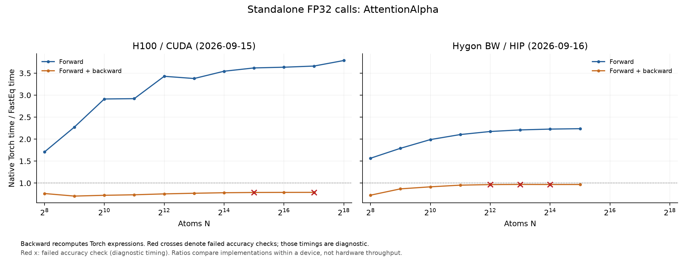

# AttentionAlpha performance

Forward is faster on both measured devices; forward + backward is slower.
Parameter-gradient checks fail at two H100 sizes and three Hygon sizes. Those
backward timings are retained as diagnostic data, and Hygon also reaches a
runtime launch failure at N=65,536.

## Test scope and archived H100 correctness

The tested [fused_atten_alpha](../fasteq/triton/fused_attention_alpha.py) is
compared with the original EQv3 attention expressions from
`EquivariantGraphAttention.forward`: Torch LayerNorm, native SmoothLeakyReLU,
dropout and the weighted channel sum. The benchmark runs that operator block,
not the complete attention module or model.

Inputs are `[E, 8, 32]`, `E=32N`; dropout is disabled in the main sweep.
Outputs, input gradients, normalization parameters and `alpha_dot` gradients
are compared with Torch FP32 using `atol=5e-5, rtol=5e-4`.

Of 14 scaling/small-shape cases, 12 pass and 2 fail. Both failures affect the
`alpha_dot` gradient; outputs and other requested gradients pass in those cases.
The separate self-test and the irregular, strided-input check pass.

| Failed N | Gradient | Failing elements | Maximum tolerance ratio |
| ---: | --- | ---: | ---: |
| 32,768 | alpha_dot | 1 | 2.626102 |
| 131,072 | alpha_dot | 2 | 7.680816 |

## Performance

H100 records use Torch 2.11.0+cu128 / Triton 3.6.0 and archived FastEq commit
`3bc9a82d40ef646c3ce75f6f517e3f618fb12754`. The fresh Hygon BW run uses
Torch 2.7.1 / HIP 6.3.26045 / Triton 3.1.0 and commit
`d37eacaf21b5048159a1211794efbb58941485a9`. Both use FP32 and the same
operator configurations. See the [device and source record](eqv3_validation.md#hygon-rerun-2026-09-16).
The table shows N=4096 and the largest common runnable N for each mode. Speedup is Torch time / FastEq time.
Five warmups and 20 synchronized GPU-event samples were used per point.
Forward + backward includes all requested first-order gradients, without an optimizer.
Peak memory is allocator-allocated memory, including inputs and results.

| Device | Operator | N | Mode | Torch ms | FastEq ms | Speedup | Peak GiB (Torch / FastEq) | Accuracy at this point |
| --- | --- | ---: | --- | ---: | ---: | ---: | ---: | --- |
| H100 | AttentionAlpha | 4,096 | Forward | 2.3449 | 0.6840 | 3.43× | 0.781 / 0.129 | Pass |
| H100 | AttentionAlpha | 262,144 | Forward | 152.8908 | 40.3675 | 3.79× | 48.031 / 8.250 | Pass |
| H100 | AttentionAlpha | 4,096 | Forward + backward | 4.5485 | 6.0283 | 0.75× | 1.074 / 1.270 | Pass |
| H100 | AttentionAlpha | 131,072 | Forward + backward | 142.3553 | 180.3597 | 0.79× | 32.438 / 40.500 | **Failed or unavailable; diagnostic timing** |
| Hygon BW | AttentionAlpha | 4,096 | Forward | 7.9369 | 3.6519 | 2.17× | 0.781 / 0.129 | Pass |
| Hygon BW | AttentionAlpha | 32,768 | Forward | 63.0174 | 28.1698 | 2.24× | 6.031 / 1.031 | Pass |
| Hygon BW | AttentionAlpha | 4,096 | Forward + backward | 19.1046 | 19.7792 | 0.97× | 1.074 / 1.266 | **Failed or unavailable; diagnostic timing** |
| Hygon BW | AttentionAlpha | 32,768 | Forward + backward | 150.7646 | 155.7273 | 0.97× | 8.156 / 10.125 | Pass |

Backward recomputes the Torch expressions with autograd. Its measured cost
is included in forward + backward. Red crosses mark failed parameter-gradient
checks. The largest passing complete-gradient point is N=65,536 on H100
and N=32,768 on Hygon. Neither value guarantees all smaller sizes pass.

## Scaling boundaries

| Device | Operator | Mode | Backend | Last successful N | Next N | Stop |
| --- | --- | --- | --- | ---: | ---: | --- |
| H100 | AttentionAlpha | Forward | Torch | 262,144 | 524,288 | OOM |
| H100 | AttentionAlpha | Forward | FastEq | 524,288 | 1,048,576 | FALLBACK |
| H100 | AttentionAlpha | Forward + backward | Torch | 262,144 | 524,288 | OOM |
| H100 | AttentionAlpha | Forward + backward | FastEq | 131,072 | 262,144 | OOM |
| Hygon BW | AttentionAlpha | Forward | Torch | 262,144 | 524,288 | OOM |
| Hygon BW | AttentionAlpha | Forward | FastEq | 32,768 | 65,536 | ERROR |
| Hygon BW | AttentionAlpha | Forward + backward | Torch | 131,072 | 262,144 | OOM |
| Hygon BW | AttentionAlpha | Forward + backward | FastEq | 32,768 | 65,536 | ERROR |

`FALLBACK` means the public adapter would use Torch above its input-size
threshold. The harness stopped before allocating that next shape; it is not
an OOM. Rows labelled `OOM` are actual allocation failures. Hygon `ERROR`
rows fail during the Triton forward-kernel launch and are not OOM. Running above
Torch's memory ceiling is not a matched accuracy check.

## Records and reproduction

The [shared measurement method](eqv3_validation.md#measurement-method) defines
timing, memory, tolerance and stopping rules. These are standalone operator
measurements; complete-model performance was not measured. H100 timings remain the 2026-09-15 archive; Hygon timings and
checks are a fresh 2026-09-16 run. Compare implementations within each device,
not absolute hardware throughput across the differing software stacks.

Use operator key `alpha` in [paired timings](eqv3_validation/2026-09-15/paired.csv),
[accuracy records](eqv3_validation/2026-09-15/correctness_summary.json) and
[boundary details](eqv3_validation/2026-09-15/boundaries.csv).
The [failure records](eqv3_validation/2026-09-15/failures.csv) include the failing values and positions.

Follow the [reproduction instructions](eqv3_validation/2026-09-15/REPRODUCE.md) with
`run.py --ops alpha` in a new results directory.

## Hygon correctness and run record: 2026-09-16

Fresh measurements ran on `a14r1n09`, one Hygon BW/gfx936 DCU, Slurm job
`838109`. The H100 comparison is the existing `gxn70` GPU 5 record.
The [new manifest](eqv3_validation/2026-09-16-hygon/manifest.json) records the actual source hashes,
environment, and reference provenance. Production operators were not changed
during this validation. Default and operator-specific tolerances are unchanged.

| Hygon operator | Full-tensor scaling/small-shape checks | Statuses | Largest passing forward N | Largest passing forward + backward N |
| --- | ---: | --- | ---: | ---: |
| AttentionAlpha | 11 | 3 FAIL, 8 PASS | 32,768 | 32,768 |

Failing elements are retained at the original tolerance; related backward
timings are diagnostic. A passing forward measurement remains separately qualified.

| Operator | N | Tensor | Failing elements | Maximum error / tolerance |
| --- | ---: | --- | ---: | ---: |
| AttentionAlpha | 16,384 | alpha_dot | 2 | 2.402675 |
| AttentionAlpha | 4,096 | alpha_dot | 1 | 1.332719 |
| AttentionAlpha | 8,192 | alpha_dot | 1 | 1.733434 |

The Hygon sweep encountered these execution boundaries:

- AttentionAlpha, Forward, fused, N=65,536: `Triton Error [HIP]:  Code: 1, Messsage: invalid argument` (stage: `warmup_memory_timing`).

- AttentionAlpha, Forward + backward, fused, N=65,536: `Triton Error [HIP]:  Code: 1, Messsage: invalid argument` (stage: `warmup_memory_timing`).

These are observed runtime failures. No successful FastEq timing or memory
ceiling is inferred beyond them, and they are not counted as allocation OOM.

[Fresh paired timings](eqv3_validation/2026-09-16-hygon/paired.csv), [accuracy metrics](eqv3_validation/2026-09-16-hygon/correctness_summary.json),
[failures](eqv3_validation/2026-09-16-hygon/failures.csv), [stopping boundaries](eqv3_validation/2026-09-16-hygon/boundaries.csv),
[raw point records](eqv3_validation/2026-09-16-hygon/raw_results.json.gz), and [reproduction](eqv3_validation/2026-09-16-hygon/REPRODUCE.md).
Each timing point stores its individual samples and memory probe. Shared-mask
dropout comparisons, independent processes, and graph preparation follow the
same method as the H100 run. The combined figures plot within-device speedup.
A largest passing N describes one sampled point; it does not imply that every
smaller size passes. Any FastEq-only sizes beyond Torch have no matched Torch
accuracy check.
