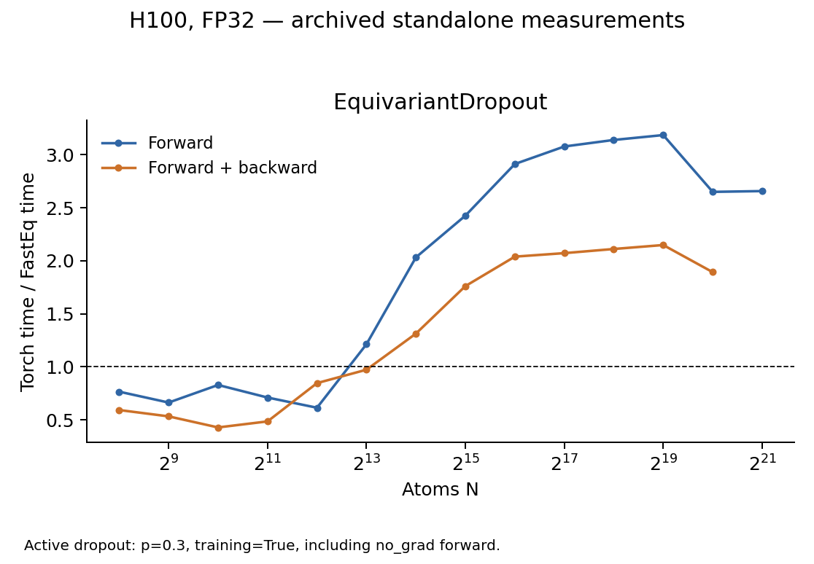

# Equivariant Dropout performance

All tested output and gradient comparisons pass. At N=4096 the operator is
slower than Torch; at the largest common scales it is faster. The results
measure active dropout rather than the evaluation-mode identity path.

## Test scope and correctness

The tested [EquivariantDropout](../fasteq/triton/fused_equivariant_dropout.py)
is compared with the original EQv3 `EquivariantDropout` in `drop.py`.
Inputs are `[N, 16, 128]`, Lmax=3, with dropout probability 0.3 and
`training=True`, including when forward is measured under `no_grad`.

All 17 scaling/small-shape cases pass. Correctness checks replay the same
sampled mask into the original Torch forward, preserving its broadcast and
multiplication logic. Output and input-gradient comparisons require exact
equality. During timing, each implementation generates its own mask normally.

The separate self-test, C=13 strided-input checks and an exactly-zero-input
mask-replay check pass. These checks validate output and gradient semantics
with the same mask; they do not require the two RNG implementations to
produce identical random streams.

## Performance

H100 80GB, FP32, Torch 2.11.0+cu128, Triton 3.6.0; archived FastEq commit
`3bc9a82d40ef646c3ce75f6f517e3f618fb12754`. The table shows N=4096 and the
largest common runnable N for each mode. Speedup is Torch time / FastEq time.
Five warmups and 20 synchronized GPU-event samples were used per point.
Forward + backward includes all requested first-order gradients, without an optimizer.
Peak memory is allocator-allocated memory, including inputs and results.

| Operator | N | Mode | Torch ms | FastEq ms | Speedup | Peak GiB (Torch / FastEq) | Accuracy at this point |
| --- | ---: | --- | ---: | ---: | ---: | ---: | --- |
| EquivariantDropout | 4,096 | Forward | 0.1083 | 0.1767 | 0.61× | 0.094 / 0.063 | Pass |
| EquivariantDropout | 4,096 | Forward + backward | 0.2162 | 0.2557 | 0.85× | 0.156 / 0.125 | Pass |
| EquivariantDropout | 2,097,152 | Forward | 39.0111 | 14.6830 | 2.66× | 48.000 / 32.000 | Pass |
| EquivariantDropout | 1,048,576 | Forward + backward | 27.8281 | 14.7071 | 1.89× | 40.000 / 32.000 | Pass |

The same p=0.3 training configuration is used for all curve points. Backward
reuses the sampled mask.

## Scaling boundaries

| Operator | Mode | Backend | Last successful N | Next N | Stop |
| --- | --- | --- | ---: | ---: | --- |
| EquivariantDropout | Forward | Torch | 2,097,152 | 4,194,304 | OOM |
| EquivariantDropout | Forward | FastEq | 4,194,304 | 8,388,608 | OOM |
| EquivariantDropout | Forward + backward | Torch | 1,048,576 | 2,097,152 | OOM |
| EquivariantDropout | Forward + backward | FastEq | 2,097,152 | 4,194,304 | OOM |

Both implementations reached actual OOM in this sweep. The larger FastEq-only
successful shapes have timing and output samples but no matched Torch accuracy
check beyond Torch's memory ceiling.

## Records and reproduction

The [shared measurement method](eqv3_validation.md#measurement-method) defines
timing, memory, tolerance and stopping rules. These are standalone operator
measurements; complete-model performance and HIP execution were not measured
in this sweep. This documentation split reuses the existing measurements.

Use operator key `dropout` in [paired timings](eqv3_validation/2026-09-15/paired.csv),
[accuracy records](eqv3_validation/2026-09-15/correctness_summary.json) and
[boundary details](eqv3_validation/2026-09-15/boundaries.csv).
The [additional checks](eqv3_validation/2026-09-15/extra_checks.json) and
[zero-input mask test](eqv3_validation/2026-09-15/dropout_zero_check.json) cover the extra cases.

Follow the [reproduction instructions](eqv3_validation/2026-09-15/REPRODUCE.md) with
`run.py --ops dropout` in a new results directory.
