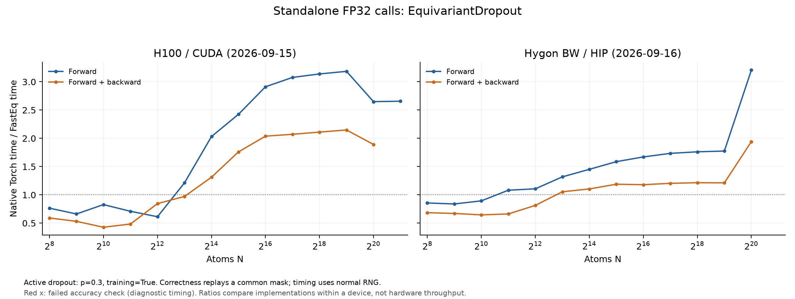

# Equivariant Dropout performance

All tested output and gradient comparisons pass on both devices. At N=4096,
forward + backward is slower than Torch on both; forward is 0.61x on H100 and
1.11x on Hygon. Larger common scales show speedups. Hygon stops at a runtime
launch failure at N=2,097,152. The measurements use active training dropout.

## Test scope and archived H100 correctness

The tested [EquivariantDropout](../fasteq/triton/fused_equivariant_dropout.py)
is compared with the original EQv3 `EquivariantDropout` in `drop.py`.
Inputs are `[N, 16, 128]`, Lmax=3, with dropout probability 0.3 and
`training=True`, including when forward is measured under `no_grad`.

All 17 scaling/small-shape cases pass. Correctness checks replay the same
sampled mask into the original Torch forward, preserving its broadcast and
multiplication logic. Output and input-gradient comparisons require exact
equality. During timing, each implementation generates its own mask normally.

The separate self-test, C=13 strided-input checks and an exactly-zero-input
mask-replay check pass. These checks validate output and gradient semantics
with the same mask; they do not require the two RNG implementations to
produce identical random streams.

## Performance

H100 records use Torch 2.11.0+cu128 / Triton 3.6.0 and archived FastEq commit
`3bc9a82d40ef646c3ce75f6f517e3f618fb12754`. The fresh Hygon BW run uses
Torch 2.7.1 / HIP 6.3.26045 / Triton 3.1.0 and commit
`d37eacaf21b5048159a1211794efbb58941485a9`. Both use FP32 and the same
operator configurations. See the [device and source record](eqv3_validation.md#hygon-rerun-2026-09-16).
The table shows N=4096 and the largest common runnable N for each mode. Speedup is Torch time / FastEq time.
Five warmups and 20 synchronized GPU-event samples were used per point.
Forward + backward includes all requested first-order gradients, without an optimizer.
Peak memory is allocator-allocated memory, including inputs and results.

| Device | Operator | N | Mode | Torch ms | FastEq ms | Speedup | Peak GiB (Torch / FastEq) | Accuracy at this point |
| --- | --- | ---: | --- | ---: | ---: | ---: | ---: | --- |
| H100 | EquivariantDropout | 4,096 | Forward | 0.1083 | 0.1767 | 0.61× | 0.094 / 0.063 | Pass |
| H100 | EquivariantDropout | 2,097,152 | Forward | 39.0111 | 14.6830 | 2.66× | 48.000 / 32.000 | Pass |
| H100 | EquivariantDropout | 4,096 | Forward + backward | 0.2162 | 0.2557 | 0.85× | 0.156 / 0.125 | Pass |
| H100 | EquivariantDropout | 1,048,576 | Forward + backward | 27.8281 | 14.7071 | 1.89× | 40.000 / 32.000 | Pass |
| Hygon BW | EquivariantDropout | 4,096 | Forward | 0.2967 | 0.2680 | 1.11× | 0.094 / 0.063 | Pass |
| Hygon BW | EquivariantDropout | 1,048,576 | Forward | 96.4064 | 30.0622 | 3.21× | 24.000 / 16.000 | Pass |
| Hygon BW | EquivariantDropout | 4,096 | Forward + backward | 0.3786 | 0.4650 | 0.81× | 0.156 / 0.125 | Pass |
| Hygon BW | EquivariantDropout | 1,048,576 | Forward + backward | 116.6152 | 60.0472 | 1.94× | 40.000 / 32.000 | Pass |

The same p=0.3 training configuration is used for all curve points. Backward
reuses the sampled mask.

## Scaling boundaries

| Device | Operator | Mode | Backend | Last successful N | Next N | Stop |
| --- | --- | --- | --- | ---: | ---: | --- |
| H100 | EquivariantDropout | Forward | Torch | 2,097,152 | 4,194,304 | OOM |
| H100 | EquivariantDropout | Forward | FastEq | 4,194,304 | 8,388,608 | OOM |
| H100 | EquivariantDropout | Forward + backward | Torch | 1,048,576 | 2,097,152 | OOM |
| H100 | EquivariantDropout | Forward + backward | FastEq | 2,097,152 | 4,194,304 | OOM |
| Hygon BW | EquivariantDropout | Forward | Torch | 2,097,152 | 4,194,304 | OOM |
| Hygon BW | EquivariantDropout | Forward | FastEq | 1,048,576 | 2,097,152 | ERROR |
| Hygon BW | EquivariantDropout | Forward + backward | Torch | 1,048,576 | 2,097,152 | OOM |
| Hygon BW | EquivariantDropout | Forward + backward | FastEq | 1,048,576 | 2,097,152 | ERROR |

Rows labelled `OOM` are actual allocation failures in the corresponding run. The larger FastEq-only
successful shapes have timing and output samples but no matched Torch accuracy
check beyond Torch's memory ceiling.

## Records and reproduction

The [shared measurement method](eqv3_validation.md#measurement-method) defines
timing, memory, tolerance and stopping rules. These are standalone operator
measurements; complete-model performance was not measured. H100 timings remain the 2026-09-15 archive; Hygon timings and
checks are a fresh 2026-09-16 run. Compare implementations within each device,
not absolute hardware throughput across the differing software stacks.

Use operator key `dropout` in [paired timings](eqv3_validation/2026-09-15/paired.csv),
[accuracy records](eqv3_validation/2026-09-15/correctness_summary.json) and
[boundary details](eqv3_validation/2026-09-15/boundaries.csv).
The [additional checks](eqv3_validation/2026-09-15/extra_checks.json) and
[zero-input mask test](eqv3_validation/2026-09-15/dropout_zero_check.json) cover the extra cases.

Follow the [reproduction instructions](eqv3_validation/2026-09-15/REPRODUCE.md) with
`run.py --ops dropout` in a new results directory.

## Hygon correctness and run record: 2026-09-16

Fresh measurements ran on `a14r1n09`, one Hygon BW/gfx936 DCU, Slurm job
`838109`. The H100 comparison is the existing `gxn70` GPU 5 record.
The [new manifest](eqv3_validation/2026-09-16-hygon/manifest.json) records the actual source hashes,
environment, and reference provenance. Production operators were not changed
during this validation. Default and operator-specific tolerances are unchanged.

| Hygon operator | Full-tensor scaling/small-shape checks | Statuses | Largest passing forward N | Largest passing forward + backward N |
| --- | ---: | --- | ---: | ---: |
| EquivariantDropout | 16 | 16 PASS | 1,048,576 | 1,048,576 |

The Hygon sweep encountered these execution boundaries:

- EquivariantDropout, Forward, fused, N=2,097,152: `Triton Error [HIP]:  Code: 1, Messsage: invalid argument` (stage: `warmup_memory_timing`).

- EquivariantDropout, Forward + backward, fused, N=2,097,152: `Triton Error [HIP]:  Code: 1, Messsage: invalid argument` (stage: `warmup_memory_timing`).

These are observed runtime failures. No successful FastEq timing or memory
ceiling is inferred beyond them, and they are not counted as allocation OOM.

[Fresh paired timings](eqv3_validation/2026-09-16-hygon/paired.csv), [accuracy metrics](eqv3_validation/2026-09-16-hygon/correctness_summary.json),
[failures](eqv3_validation/2026-09-16-hygon/failures.csv), [stopping boundaries](eqv3_validation/2026-09-16-hygon/boundaries.csv),
[raw point records](eqv3_validation/2026-09-16-hygon/raw_results.json.gz), and [reproduction](eqv3_validation/2026-09-16-hygon/REPRODUCE.md).
Each timing point stores its individual samples and memory probe. Shared-mask
dropout comparisons, independent processes, and graph preparation follow the
same method as the H100 run. The combined figures plot within-device speedup.
A largest passing N describes one sampled point; it does not imply that every
smaller size passes. Any FastEq-only sizes beyond Torch have no matched Torch
accuracy check.
