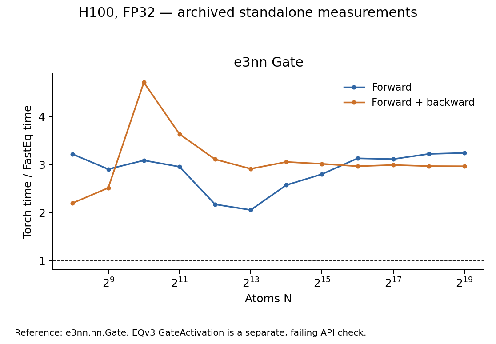

# Equivariant Gate performance

The measured e3nn Gate interface passes the tested cases and is faster in
both forward and forward + backward. The separate EQv3 GateActivation
interface fails to run and has no valid performance result.

## Test scope and correctness

The tested [FastEquivariantGate](../fasteq/triton/fused_equivariant_gate.py)
is compared with the installed `e3nn.nn.Gate` (e3nn 0.4.4). With Lmax=3 and
C=128, input shape is `[N, 2432]` and output shape is `[N, 2048]`; scalar
features use SiLU and gates use sigmoid.

All 15 scaling/small-shape checks pass for outputs and input gradients with
`atol=5e-5, rtol=5e-4` against Torch FP32. Additional C=13 checks pass for
contiguous and strided inputs.

A distinct test of [fused_gate_activation](../fasteq/triton/fused_gate_act.py)
against the original EQv3 `GateActivation` fails because the public class
has no `forward()` method. The e3nn Gate results below do not validate that
interface or complete EQv3 model integration.

## Performance

H100 80GB, FP32, Torch 2.11.0+cu128, Triton 3.6.0; archived FastEq commit
`3bc9a82d40ef646c3ce75f6f517e3f618fb12754`. The table shows N=4096 and the
largest common runnable N for each mode. Speedup is Torch time / FastEq time.
Five warmups and 20 synchronized GPU-event samples were used per point.
Forward + backward includes all requested first-order gradients, without an optimizer.
Peak memory is allocator-allocated memory, including inputs and results.

| Operator | N | Mode | Torch ms | FastEq ms | Speedup | Peak GiB (Torch / FastEq) | Accuracy at this point |
| --- | ---: | --- | ---: | ---: | ---: | ---: | --- |
| e3nn Gate | 4,096 | Forward | 0.2278 | 0.1048 | 2.17× | 0.133 / 0.068 | Pass |
| e3nn Gate | 4,096 | Forward + backward | 1.2874 | 0.4136 | 3.11× | 0.223 / 0.137 | Pass |
| e3nn Gate | 524,288 | Forward | 16.5866 | 5.1104 | 3.25× | 17.000 / 8.750 | Pass |
| e3nn Gate | 524,288 | Forward + backward | 102.0716 | 34.3886 | 2.97× | 28.500 / 17.500 | Pass |

Both timing modes use the public e3nn-compatible operator call. The reference
and API are the same throughout the curve.

## Scaling boundaries

| Operator | Mode | Backend | Last successful N | Next N | Stop |
| --- | --- | --- | ---: | ---: | --- |
| e3nn Gate | Forward | Torch | 1,048,576 | 2,097,152 | OOM |
| e3nn Gate | Forward | FastEq | 524,288 | 1,048,576 | INDEX_GUARD |
| e3nn Gate | Forward + backward | Torch | 1,048,576 | 2,097,152 | OOM |
| e3nn Gate | Forward + backward | FastEq | 524,288 | 1,048,576 | INDEX_GUARD |

FastEq stops at a harness `INDEX_GUARD` before the signed 32-bit row-offset
range can overflow; the source has no corresponding runtime guard. The next
shape was not allocated, so this is not a measured FastEq OOM. Torch reached
actual OOM at the listed next shapes.

## Records and reproduction

The [shared measurement method](eqv3_validation.md#measurement-method) defines
timing, memory, tolerance and stopping rules. These are standalone operator
measurements; complete-model performance and HIP execution were not measured
in this sweep. This documentation split reuses the existing measurements.

Use operator key `gate` in [paired timings](eqv3_validation/2026-09-15/paired.csv),
[accuracy records](eqv3_validation/2026-09-15/correctness_summary.json) and
[boundary details](eqv3_validation/2026-09-15/boundaries.csv).
The [API checks](eqv3_validation/2026-09-15/extra_checks.json) retain the GateActivation failure;
[layout checks](eqv3_validation/2026-09-15/gate_strided_check.json) record the strided-input result.

Follow the [reproduction instructions](eqv3_validation/2026-09-15/REPRODUCE.md) with
`run.py --ops gate` in a new results directory.
