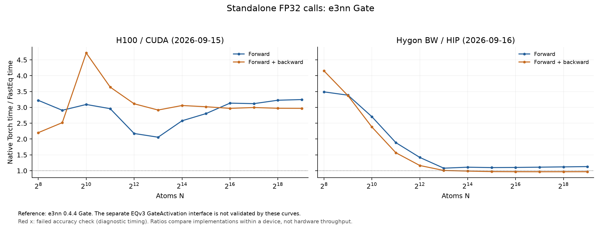

# Equivariant Gate performance

The measured e3nn Gate interface passes the tested cases on both devices.
H100 shows speedups throughout the sweep; Hygon forward + backward falls to
0.97x at N=524,288. The separate EQv3 GateActivation interface fails to run
on both devices and has no valid performance result.

## Test scope and archived H100 correctness

The tested [FastEquivariantGate](../fasteq/triton/fused_equivariant_gate.py)
is compared with the installed `e3nn.nn.Gate` (e3nn 0.4.4). With Lmax=3 and
C=128, input shape is `[N, 2432]` and output shape is `[N, 2048]`; scalar
features use SiLU and gates use sigmoid.

All 15 scaling/small-shape checks pass for outputs and input gradients with
`atol=5e-5, rtol=5e-4` against Torch FP32. Additional C=13 checks pass for
contiguous and strided inputs.

A distinct test of [fused_gate_activation](../fasteq/triton/fused_gate_act.py)
against the original EQv3 `GateActivation` fails because the public class
has no `forward()` method. The e3nn Gate results below do not validate that
interface or complete EQv3 model integration.

## Performance

H100 records use Torch 2.11.0+cu128 / Triton 3.6.0 and archived FastEq commit
`3bc9a82d40ef646c3ce75f6f517e3f618fb12754`. The fresh Hygon BW run uses
Torch 2.7.1 / HIP 6.3.26045 / Triton 3.1.0 and commit
`d37eacaf21b5048159a1211794efbb58941485a9`. Both use FP32 and the same
operator configurations. See the [device and source record](eqv3_validation.md#hygon-rerun-2026-09-16).
The table shows N=4096 and the largest common runnable N for each mode. Speedup is Torch time / FastEq time.
Five warmups and 20 synchronized GPU-event samples were used per point.
Forward + backward includes all requested first-order gradients, without an optimizer.
Peak memory is allocator-allocated memory, including inputs and results.

| Device | Operator | N | Mode | Torch ms | FastEq ms | Speedup | Peak GiB (Torch / FastEq) | Accuracy at this point |
| --- | --- | ---: | --- | ---: | ---: | ---: | ---: | --- |
| H100 | e3nn Gate | 4,096 | Forward | 0.2278 | 0.1048 | 2.17× | 0.133 / 0.068 | Pass |
| H100 | e3nn Gate | 524,288 | Forward | 16.5866 | 5.1104 | 3.25× | 17.000 / 8.750 | Pass |
| H100 | e3nn Gate | 4,096 | Forward + backward | 1.2874 | 0.4136 | 3.11× | 0.223 / 0.137 | Pass |
| H100 | e3nn Gate | 524,288 | Forward + backward | 102.0716 | 34.3886 | 2.97× | 28.500 / 17.500 | Pass |
| Hygon BW | e3nn Gate | 4,096 | Forward | 0.6994 | 0.4930 | 1.42× | 0.133 / 0.068 | Pass |
| Hygon BW | e3nn Gate | 524,288 | Forward | 53.6779 | 47.5115 | 1.13× | 17.000 / 8.750 | Pass |
| Hygon BW | e3nn Gate | 4,096 | Forward + backward | 3.0166 | 2.5921 | 1.16× | 0.223 / 0.137 | Pass |
| Hygon BW | e3nn Gate | 524,288 | Forward + backward | 303.3184 | 313.4137 | 0.97× | 28.500 / 17.500 | Pass |

Both timing modes use the public e3nn-compatible operator call. The reference
and API are the same throughout the curve.

## Scaling boundaries

| Device | Operator | Mode | Backend | Last successful N | Next N | Stop |
| --- | --- | --- | --- | ---: | ---: | --- |
| H100 | e3nn Gate | Forward | Torch | 1,048,576 | 2,097,152 | OOM |
| H100 | e3nn Gate | Forward | FastEq | 524,288 | 1,048,576 | INDEX_GUARD |
| H100 | e3nn Gate | Forward + backward | Torch | 1,048,576 | 2,097,152 | OOM |
| H100 | e3nn Gate | Forward + backward | FastEq | 524,288 | 1,048,576 | INDEX_GUARD |
| Hygon BW | e3nn Gate | Forward | Torch | 1,048,576 | 2,097,152 | OOM |
| Hygon BW | e3nn Gate | Forward | FastEq | 524,288 | 1,048,576 | INDEX_GUARD |
| Hygon BW | e3nn Gate | Forward + backward | Torch | 1,048,576 | 2,097,152 | OOM |
| Hygon BW | e3nn Gate | Forward + backward | FastEq | 524,288 | 1,048,576 | INDEX_GUARD |

FastEq stops at a harness `INDEX_GUARD` before the signed 32-bit row-offset
range can overflow; the source has no corresponding runtime guard. The next
shape was not allocated, so this is not a measured FastEq OOM. Torch reached
actual OOM at the listed next shapes.

## Records and reproduction

The [shared measurement method](eqv3_validation.md#measurement-method) defines
timing, memory, tolerance and stopping rules. These are standalone operator
measurements; complete-model performance was not measured. H100 timings remain the 2026-09-15 archive; Hygon timings and
checks are a fresh 2026-09-16 run. Compare implementations within each device,
not absolute hardware throughput across the differing software stacks.

Use operator key `gate` in [paired timings](eqv3_validation/2026-09-15/paired.csv),
[accuracy records](eqv3_validation/2026-09-15/correctness_summary.json) and
[boundary details](eqv3_validation/2026-09-15/boundaries.csv).
The [API checks](eqv3_validation/2026-09-15/extra_checks.json) retain the GateActivation failure;
[layout checks](eqv3_validation/2026-09-15/gate_strided_check.json) record the strided-input result.

Follow the [reproduction instructions](eqv3_validation/2026-09-15/REPRODUCE.md) with
`run.py --ops gate` in a new results directory.

## Hygon correctness and run record: 2026-09-16

Fresh measurements ran on `a14r1n09`, one Hygon BW/gfx936 DCU, Slurm job
`838109`. The H100 comparison is the existing `gxn70` GPU 5 record.
The [new manifest](eqv3_validation/2026-09-16-hygon/manifest.json) records the actual source hashes,
environment, and reference provenance. Production operators were not changed
during this validation. Default and operator-specific tolerances are unchanged.

| Hygon operator | Full-tensor scaling/small-shape checks | Statuses | Largest passing forward N | Largest passing forward + backward N |
| --- | ---: | --- | ---: | ---: |
| e3nn Gate | 15 | 15 PASS | 524,288 | 524,288 |

The separate EQv3 GateActivation API check is **ERROR** on Hygon.
The e3nn-compatible Gate curve does not validate that distinct interface.

[Fresh paired timings](eqv3_validation/2026-09-16-hygon/paired.csv), [accuracy metrics](eqv3_validation/2026-09-16-hygon/correctness_summary.json),
[failures](eqv3_validation/2026-09-16-hygon/failures.csv), [stopping boundaries](eqv3_validation/2026-09-16-hygon/boundaries.csv),
[raw point records](eqv3_validation/2026-09-16-hygon/raw_results.json.gz), and [reproduction](eqv3_validation/2026-09-16-hygon/REPRODUCE.md).
Each timing point stores its individual samples and memory probe. Shared-mask
dropout comparisons, independent processes, and graph preparation follow the
same method as the H100 run. The combined figures plot within-device speedup.
A largest passing N describes one sampled point; it does not imply that every
smaller size passes. Any FastEq-only sizes beyond Torch have no matched Torch
accuracy check.
