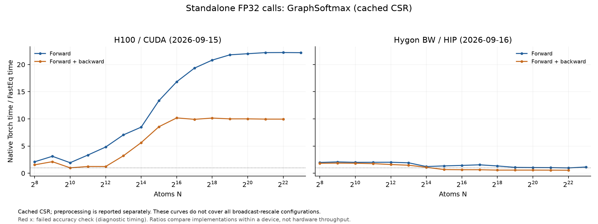

# GraphSoftmax performance

The standard scaling cases pass on both devices, but a separate
broadcast-rescale gradient check fails intermittently on both. The successful timings do not establish correctness
for every configuration.

## Test scope and archived H100 correctness

The tested [FusedGraphSoftmax](../fasteq/triton/graph_softmax.py) is compared with
the original EQv3 `GraphSoftmax` in `softmax.py`. Inputs are `[E, 8]`, with
`E=32N`, 32 incoming edges per node, soft cap 3, epsilon `1e-16`, per-edge
rescale `[E, 1]` and no dropout. The destination indices are unsorted.

All 19 scaling/small-shape checks passed, covering outputs, input gradients
and rescale gradients. Five additional runs against the original EQv3 class
produced one failed assertion out of 1720: `E=73, N=17, H=3`, rescale `[1, 3]`,
soft cap 3, epsilon `1e-16`, dropout 0. The rescale-gradient tolerance ratio
was 1.016865, exceeding the passing limit of 1. The initial self-test also
failed once; a one-off rerun passed. Tolerances were not relaxed.

Forward uses `atol=3e-6, rtol=3e-5`; gradients use
`atol=3e-5, rtol=3e-4` against native Torch FP32.

## Performance

H100 records use Torch 2.11.0+cu128 / Triton 3.6.0 and archived FastEq commit
`3bc9a82d40ef646c3ce75f6f517e3f618fb12754`. The fresh Hygon BW run uses
Torch 2.7.1 / HIP 6.3.26045 / Triton 3.1.0 and commit
`d37eacaf21b5048159a1211794efbb58941485a9`. Both use FP32 and the same
operator configurations. See the [device and source record](eqv3_validation.md#hygon-rerun-2026-09-16).
The table shows N=4096 and the largest common runnable N for each mode. Speedup is Torch time / FastEq time.
Five warmups and 20 synchronized GPU-event samples were used per point.
Forward + backward includes all requested first-order gradients, without an optimizer.
Peak memory is allocator-allocated memory, including inputs and results.

| Device | Operator | N | Mode | Torch ms | FastEq ms | Speedup | Peak GiB (Torch / FastEq) | Accuracy at this point |
| --- | --- | ---: | --- | ---: | ---: | ---: | ---: | --- |
| H100 | GraphSoftmax | 4,096 | Forward | 0.2967 | 0.0616 | 4.82× | 0.021 / 0.010 | Pass |
| H100 | GraphSoftmax | 8,388,608 | Forward | 400.0083 | 18.0312 | 22.18× | 43.250 / 21.063 | Pass |
| H100 | GraphSoftmax | 4,096 | Forward + backward | 0.4704 | 0.3810 | 1.23× | 0.044 / 0.026 | Pass |
| H100 | GraphSoftmax | 4,194,304 | Forward + backward | 342.3557 | 34.3892 | 9.96× | 45.500 / 27.031 | Pass |
| Hygon BW | GraphSoftmax | 4,096 | Forward | 0.3650 | 0.1807 | 2.02× | 0.021 / 0.010 | Pass |
| Hygon BW | GraphSoftmax | 8,388,608 | Forward | 272.3874 | 237.7672 | 1.15× | 43.250 / 21.063 | Pass |
| Hygon BW | GraphSoftmax | 4,096 | Forward + backward | 0.7941 | 0.4957 | 1.60× | 0.044 / 0.026 | Pass |
| Hygon BW | GraphSoftmax | 4,194,304 | Forward + backward | 278.6249 | 508.1220 | 0.55× | 45.500 / 27.031 | Pass |

The table and curve reuse a prepared CSR graph. They exclude per-call CSR
construction. The broadcast-rescale failure is separate from these curve points.

## Scaling boundaries

| Device | Operator | Mode | Backend | Last successful N | Next N | Stop |
| --- | --- | --- | --- | ---: | ---: | --- |
| H100 | GraphSoftmax | Forward | Torch | 8,388,608 | 16,777,216 | OOM |
| H100 | GraphSoftmax | Forward | FastEq | 16,777,216 | 33,554,432 | OOM |
| H100 | GraphSoftmax | Forward + backward | Torch | 4,194,304 | 8,388,608 | OOM |
| H100 | GraphSoftmax | Forward + backward | FastEq | 8,388,608 | 16,777,216 | OOM |
| Hygon BW | GraphSoftmax | Forward | Torch | 8,388,608 | 16,777,216 | OOM |
| Hygon BW | GraphSoftmax | Forward | FastEq | 8,388,608 | 16,777,216 | ERROR |
| Hygon BW | GraphSoftmax | Forward + backward | Torch | 4,194,304 | 8,388,608 | OOM |
| Hygon BW | GraphSoftmax | Forward + backward | FastEq | 8,388,608 | 16,777,216 | OOM |

Rows labelled `OOM` are actual allocation failures; `ERROR` is an execution
failure, not an OOM. See the fresh Hygon record for its exact failure stage. The largest
FastEq-only successful scale has no matched Torch accuracy comparison.

## Cost of preparing the graph

At N=4096, including CSR construction and its host synchronization changes the
comparison below. These are synchronized **wall-clock** medians, rather than
the cached-CSR GPU intervals in the preceding table.

| Device | Mode | Torch wall ms | FastEq with CSR preparation wall ms | Speedup |
| --- | --- | ---: | ---: | ---: |
| H100 | Forward | 0.3099 | 0.3616 | 0.86× |
| H100 | Forward + backward | 0.4841 | 0.8310 | 0.58× |
| Hygon BW | Forward | 0.3945 | 0.7480 | 0.53× |
| Hygon BW | Forward + backward | 0.8240 | 1.0567 | 0.78× |

Per-call graph preparation was measured through N=65536. Choose the comparison
that matches whether an application can reuse its graph. Cached-CSR peak
memory includes the stored graph but excludes construction temporaries.

## Records and reproduction

The [shared measurement method](eqv3_validation.md#measurement-method) defines
timing, memory, tolerance and stopping rules. These are standalone operator
measurements; complete-model performance was not measured. H100 timings remain the 2026-09-15 archive; Hygon timings and
checks are a fresh 2026-09-16 run. Compare implementations within each device,
not absolute hardware throughput across the differing software stacks.

Use operator key `softmax` in [paired timings](eqv3_validation/2026-09-15/paired.csv),
[accuracy records](eqv3_validation/2026-09-15/correctness_summary.json) and
[boundary details](eqv3_validation/2026-09-15/boundaries.csv).
The [repeated native checks](eqv3_validation/2026-09-15/softmax_native_checks.json) and
[saved failing tensors](eqv3_validation/2026-09-15/softmax_failures/native_4_1563.pt) preserve
the intermittent failure for diagnosis.

Follow the [reproduction instructions](eqv3_validation/2026-09-15/REPRODUCE.md) with
`run.py --ops softmax` in a new results directory.

## Hygon correctness and run record: 2026-09-16

Fresh measurements ran on `a14r1n09`, one Hygon BW/gfx936 DCU, Slurm job
`838109`. The H100 comparison is the existing `gxn70` GPU 5 record.
The [new manifest](eqv3_validation/2026-09-16-hygon/manifest.json) records the actual source hashes,
environment, and reference provenance. Production operators were not changed
during this validation. Default and operator-specific tolerances are unchanged.

| Hygon operator | Full-tensor scaling/small-shape checks | Statuses | Largest passing forward N | Largest passing forward + backward N |
| --- | ---: | --- | ---: | ---: |
| GraphSoftmax | 19 | 19 PASS | 8,388,608 | 4,194,304 |

The Hygon sweep encountered these execution boundaries:

- GraphSoftmax, Forward, fused, N=16,777,216: `Triton Error [HIP]:  Code: 1, Messsage: invalid argument` (stage: `warmup_memory_timing`).

These are observed runtime failures. No successful FastEq timing or memory
ceiling is inferred beyond them, and they are not counted as allocation OOM.

Five repeated native EQv3 checks completed **1720 assertions**, with **2 failed assertions** on Hygon.
These repeated broadcast/rescale checks are separate from the scaling points.
The existing H100 intermittent failure remains part of its own record.

Repeat 1: E=73, N=17, H=3,
rescale shape [1, 3], soft cap 3.0,
maximum error/tolerance ratio **1.144213**.
The failing component is -1.71661377e-05 (FastEq) versus 1.71661377e-05 (Torch).

Repeat 2: E=73, N=17, H=3,
rescale shape [1, 3], soft cap 3.0,
maximum error/tolerance ratio **1.588972**.
The failing component is -1.71661377e-05 (FastEq) versus 3.05175781e-05 (Torch).

[Repeated native checks and saved failures](eqv3_validation/2026-09-16-hygon/softmax_native_checks.json).

[Fresh paired timings](eqv3_validation/2026-09-16-hygon/paired.csv), [accuracy metrics](eqv3_validation/2026-09-16-hygon/correctness_summary.json),
[failures](eqv3_validation/2026-09-16-hygon/failures.csv), [stopping boundaries](eqv3_validation/2026-09-16-hygon/boundaries.csv),
[raw point records](eqv3_validation/2026-09-16-hygon/raw_results.json.gz), and [reproduction](eqv3_validation/2026-09-16-hygon/REPRODUCE.md).
Each timing point stores its individual samples and memory probe. Shared-mask
dropout comparisons, independent processes, and graph preparation follow the
same method as the H100 run. The combined figures plot within-device speedup.
A largest passing N describes one sampled point; it does not imply that every
smaller size passes. Any FastEq-only sizes beyond Torch have no matched Torch
accuracy check.
