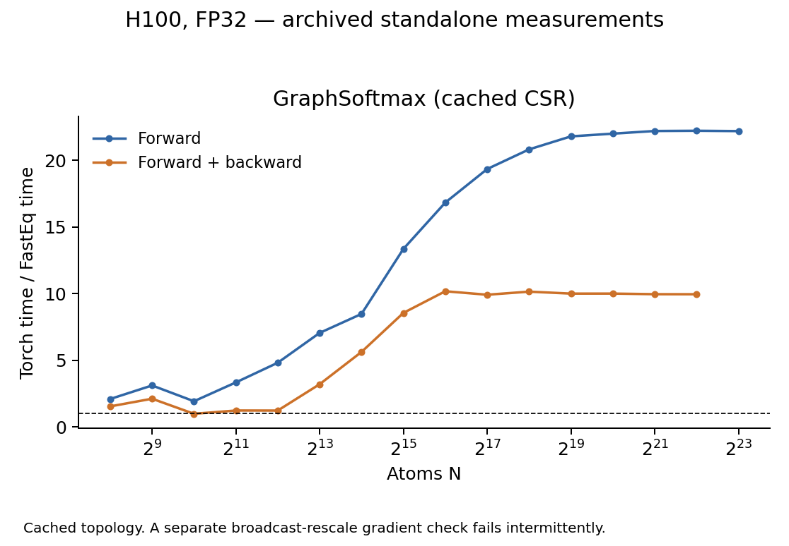

# GraphSoftmax performance

The standard scaling cases pass, but a separate broadcast-rescale gradient
check fails intermittently. The successful timings do not establish correctness
for every configuration.

## Test scope and correctness

The tested [FusedGraphSoftmax](../fasteq/triton/graph_softmax.py) is compared with
the original EQv3 `GraphSoftmax` in `softmax.py`. Inputs are `[E, 8]`, with
`E=32N`, 32 incoming edges per node, soft cap 3, epsilon `1e-16`, per-edge
rescale `[E, 1]` and no dropout. The destination indices are unsorted.

All 19 scaling/small-shape checks passed, covering outputs, input gradients
and rescale gradients. Five additional runs against the original EQv3 class
produced one failed assertion out of 1720: `E=73, N=17, H=3`, rescale `[1, 3]`,
soft cap 3, epsilon `1e-16`, dropout 0. The rescale-gradient tolerance ratio
was 1.016865, exceeding the passing limit of 1. The initial self-test also
failed once; a one-off rerun passed. Tolerances were not relaxed.

Forward uses `atol=3e-6, rtol=3e-5`; gradients use
`atol=3e-5, rtol=3e-4` against native Torch FP32.

## Performance

H100 80GB, FP32, Torch 2.11.0+cu128, Triton 3.6.0; archived FastEq commit
`3bc9a82d40ef646c3ce75f6f517e3f618fb12754`. The table shows N=4096 and the
largest common runnable N for each mode. Speedup is Torch time / FastEq time.
Five warmups and 20 synchronized GPU-event samples were used per point.
Forward + backward includes all requested first-order gradients, without an optimizer.
Peak memory is allocator-allocated memory, including inputs and results.

| Operator | N | Mode | Torch ms | FastEq ms | Speedup | Peak GiB (Torch / FastEq) | Accuracy at this point |
| --- | ---: | --- | ---: | ---: | ---: | ---: | --- |
| GraphSoftmax | 4,096 | Forward | 0.2967 | 0.0616 | 4.82× | 0.021 / 0.010 | Pass |
| GraphSoftmax | 4,096 | Forward + backward | 0.4704 | 0.3810 | 1.23× | 0.044 / 0.026 | Pass |
| GraphSoftmax | 8,388,608 | Forward | 400.0083 | 18.0312 | 22.18× | 43.250 / 21.063 | Pass |
| GraphSoftmax | 4,194,304 | Forward + backward | 342.3557 | 34.3892 | 9.96× | 45.500 / 27.031 | Pass |

The table and curve reuse a prepared CSR graph. They exclude per-call CSR
construction. The broadcast-rescale failure is separate from these curve points.

## Scaling boundaries

| Operator | Mode | Backend | Last successful N | Next N | Stop |
| --- | --- | --- | ---: | ---: | --- |
| GraphSoftmax | Forward | Torch | 8,388,608 | 16,777,216 | OOM |
| GraphSoftmax | Forward | FastEq | 16,777,216 | 33,554,432 | OOM |
| GraphSoftmax | Forward + backward | Torch | 4,194,304 | 8,388,608 | OOM |
| GraphSoftmax | Forward + backward | FastEq | 8,388,608 | 16,777,216 | OOM |

Both implementations reached actual OOM in the listed modes. The largest
FastEq-only successful scale has no matched Torch accuracy comparison.

## Cost of preparing the graph

At N=4096, including CSR construction and its host synchronization changes the
comparison below. These are synchronized **wall-clock** medians, rather than
the cached-CSR GPU intervals in the preceding table.

| Mode | Torch wall ms | FastEq with CSR preparation wall ms | Speedup |
| --- | ---: | ---: | ---: |
| Forward | 0.3099 | 0.3616 | 0.86× |
| Forward + backward | 0.4841 | 0.8310 | 0.58× |

Per-call graph preparation was measured through N=65536. Choose the comparison
that matches whether an application can reuse its graph. Cached-CSR peak
memory includes the stored graph but excludes construction temporaries.

## Records and reproduction

The [shared measurement method](eqv3_validation.md#measurement-method) defines
timing, memory, tolerance and stopping rules. These are standalone operator
measurements; complete-model performance and HIP execution were not measured
in this sweep. This documentation split reuses the existing measurements.

Use operator key `softmax` in [paired timings](eqv3_validation/2026-09-15/paired.csv),
[accuracy records](eqv3_validation/2026-09-15/correctness_summary.json) and
[boundary details](eqv3_validation/2026-09-15/boundaries.csv).
The [repeated native checks](eqv3_validation/2026-09-15/softmax_native_checks.json) and
[saved failing tensors](eqv3_validation/2026-09-15/softmax_failures/native_4_1563.pt) preserve
the intermittent failure for diagnosis.

Follow the [reproduction instructions](eqv3_validation/2026-09-15/REPRODUCE.md) with
`run.py --ops softmax` in a new results directory.
