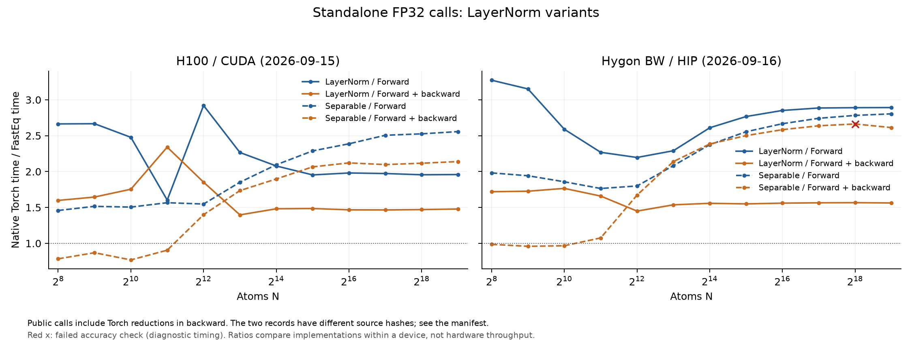

# Equivariant LayerNorm

FastEq fuses equivariant normalization for EquiformerV3 and EquiformerV2 layers,
with GPU FP32 forward execution and first-order gradients on CUDA and HIP.

The fresh Hygon scaling run includes parameter-gradient tolerance failures. See
[the exact configurations](#hygon-correctness-and-run-record-2026-09-16); the
218-test regression pass is not a claim that every larger sampled shape passes.

## Supported layers

Inputs have shape `[N, (L + 1)**2, C]`, where `N` is the number of atoms, `L` is
the maximum degree, and `C` is the channel count. Statistics are computed
independently for each atom. Let `q_l` be the mean squared feature value across
the `2*l + 1` components and `C` channels of degree `l`, after scalar centering.

| Model | Native layer | Default normalization statistics |
| --- | --- | --- |
| EquiformerV3 | `EquivariantLayerNorm` | Each degree uses its own `q_l`. |
| EquiformerV3 | `EquivariantSeparableLayerNorm` | Scalars use `q_0`; higher degrees share `mean(q_1, ..., q_L)`. |
| EquiformerV2 | `EquivariantLayerNormArraySphericalHarmonics` | Scalars use `q_0`; higher degrees share `mean(q_1, ..., q_L)`. |

The table uses the native defaults, including equal weighting of degrees where
applicable. The adapter preserves the source layer's normalization options.
Only scalar features (`l = 0`) are centered across channels. Affine scales are learned per degree and channel and shared across
that degree's components. Bias applies only to scalars when the source has it.

## Fused operations

Forward combines scalar mean, centering, squaring, weighted group reduction,
reciprocal square root with epsilon, and affine transformation in one kernel.
Each group supplies its normalization scale to the degrees listed above.

For native source adapters, Torch computes the source-ordered statistic-gradient
reductions before a shared Triton program produces `dX` and per-atom affine
parameter contributions. Torch then sums contributions across atoms, and a
shared Triton kernel writes the degree-shared parameter gradients. The same
code and reduction APIs run on CUDA and HIP; no backend-specific module is
selected. This splits part of backward fusion to preserve native FP32 tolerance
without reimplementing each backend's reduction scheduler.

Group boundaries are device buffers, avoiding unsupported `constexpr` tuple
indexing. Hardware lane width is read from the active Triton target; a
32-channel tile is independent of warp/wavefront width. The implementation uses
ordinary Triton expressions without CUDA libdevice calls or inline assembly.
The supported presets are `per_degree` (the default) and `scalar_high`.

Only requested gradients are computed. Double backward and `create_graph=True`
are unsupported. Source adapters default to `parameter_reduction="native"`.
The optional `parameter_reduction="stable"` policy uses fixed 256-row Triton
reduction trees, with `accumulation="fp32"` or `"fp64"` controlling cross-atom
accumulators. These are explicit numerical policies shared by both backends.
FP64 is a diagnostic reference, not a replacement for Torch FP32 acceptance.

## Usage

```python
from fasteq.triton import from_reference

# source is the original FP32 GPU layer; x has shape [N, (L + 1)**2, C].
op = from_reference(source)
y = op(x.requires_grad_(True))
y.square().mean().backward()
```

The adapter reuses the source parameters, so gradients reach those parameters.
Apply it to the individual normalization layers you want to replace. Both
contiguous NKC storage and KNC storage viewed as `[N, K, C]` are supported,
where `K = (L + 1)**2`. CUDA and HIP FP32 are supported execution targets.

## Validation coverage

All three native layers in the table have been compared against their unmodified
PyTorch FP32 implementations on NVIDIA H100 and Hygon BW/gfx936. Comparisons cover the output,
input gradient, and all affine parameter gradients, including NKC and KNC
storage. See the [native-layer comparison tests](../test/test_triton_equivariant_layer_norm_precision.py)
and [backward tests](../test/test_triton_equivariant_layer_norm_backward.py).

This validation covers individual model layers. Full-model inference and
training with this shared implementation have not been validated. eSEN has
not been directly tested.

## Current scope validation

After reducing the adaptation scope, the remaining suite passed **218 tests,
0 failed, 0 skipped** on H100 with Torch 2.11.0 and Triton 3.6.0. Comparisons use
the unmodified V2/V3 Torch forward and autograd implementations, including large-N
parameter gradients, NKC/KNC layouts, and two SGD steps through supported layers.
See [regression.json](eqv3_validation/2026-09-15/regression.json) for the exact
implementation, test and reference hashes. The 2026-09-15 cleanup was retested
on CUDA. On 2026-09-16 the same retained suite also passed 218 tests on Hygon; [the new regression record](eqv3_validation/2026-09-16-hygon/regression.json)
contains its source hashes and precision metrics. The fresh Hygon scaling run
found a separate Separable parameter-gradient failure, listed below.

Each LayerNorm scaling record below identifies its own measurement revision.
The [validation index](eqv3_validation.md) contains the shared testing method.

## Historical validation record: 2026-09-15

The following snapshot predates the scope cleanup. Its 305-test count describes
the original suite, not the current one. Raw records are preserved for audit;
see the [snapshot note](layernorm_validation/2026-09-15/README.md).

The shared implementation was developed from FastEq commit
`40ba40e72bee769d74a869bb4a4ba820ee1c55c0`. Both machines tested the identical
`fasteq/triton/fused_equivariant_layer_norm.py`, with SHA256:

```text
f2bc0ea975eac5bf5a16b3297415cc37d896fb8a41d5375e04e57d7ed1461520
```

The final logs and measurements below belong to this source hash. They exclude
earlier experimental implementations and the original CUDA baseline. The
baseline remains available in Git history; production does not select it as a
backend fallback.

### Machines and software

| Item | Hygon | NVIDIA |
| --- | --- | --- |
| Host | `a01r3n07` | `gxn70` |
| Device | Hygon BW, `gfx936:sramecc+:xnack-` | H100 80GB HBM3, `sm_90` |
| Reported device memory | 65,520 MiB | 81,089 MiB |
| Compute units / SMs | 80 CUs | 132 SMs |
| Wavefront / warp width | 64 | 32 |
| Allocation | One DCU, Slurm job `836140`, partition `hx1hdnormal01` | GPU 7 on a shared machine; no exclusive reservation or locked clocks |
| Torch | `2.7.1` | `2.11.0+cu128` |
| HIP | `6.3.26045` | N/A |
| Triton | HCU Triton `3.1.0` | `3.6.0` |
| Full LayerNorm suite | **305 passed, 0 failed, 0 skipped** | **305 passed, 0 failed, 0 skipped** |
| Pytest elapsed time | 227.87 s | 155.20 s |

The Hygon allocation was released after the final suite and performance steps
completed. Test durations describe these runs, not comparative hardware speed.
Validation used an operator-only loader importing the production module while
bypassing unrelated compiled package extensions. A clean package installation
was not part of this run.

### Reference sources and accuracy

EquiformerV2 uses the unmodified official
[`nets/equiformer_v2/layer_norm.py`](https://github.com/atomicarchitects/equiformer_v2/blob/d5ad4be729b56f74012ebb7f097f77c5b00a1004/nets/equiformer_v2/layer_norm.py)
at commit `d5ad4be729b56f74012ebb7f097f77c5b00a1004`, SHA256
`fdd7955f1fc3ef4e0a0ccbfb761128b5b269ad09f50423428f77aee12a53480c`.
All 24 previously skipped V2 source-comparison cases ran and passed on both
devices.

EquiformerV3 uses the unmodified original file
`experimental/models/equiformer_v3/layer_norm.py` from the Hygon source tree
labelled `equiformer_v3-a7300c58df683dc99cb48027d5bfd4c887486c48`, SHA256
`41e00b377cbacef4713d88697c06e419f3b8c208d9fcc55be78b53fd5a23c2c6`.
The directory label was recorded; its Git commit was not independently verified.
The file hash identifies the actual reference used.

The three complete test modules were
[`test_triton_equivariant_layer_norm.py`](../test/test_triton_equivariant_layer_norm.py),
[`test_triton_equivariant_layer_norm_backward.py`](../test/test_triton_equivariant_layer_norm_backward.py),
and [`test_triton_equivariant_layer_norm_precision.py`](../test/test_triton_equivariant_layer_norm_precision.py).
They cover forward output, `dX`, all affine parameter gradients, NKC/KNC layouts,
irregular channel widths, severe cancellation, small epsilon, and the precision
regressions at N=32,768 / 131,072 / 262,144 / 524,288. These large-N checks are
accuracy regressions, not a performance sweep to OOM.

Native Torch FP32 comparisons normally require elementwise:

```text
abs(actual - reference) <= 5e-5 + 5e-4 * abs(reference)
```

Existing stricter mathematical and backward regression tolerances are retained.
Mean, moment, and rstd alignment tests now use the same tolerance on both
backends; bitwise equality is not required. For native comparison cases that
record `max_tolerance_ratio`, define the ratio as the maximum of
`abs(actual-reference) / (5e-5 + 5e-4*abs(reference))`; a value at most 1 passes.
The maxima below summarize those recorded properties (335 per device), not the
separate tests with stricter tolerances:

| Largest recorded tolerance ratio | Hygon | H100 |
| --- | ---: | ---: |
| Forward output | 0.013968 | 0.013116 |
| Input gradient `dX` | 0.007151 | 0.007277 |
| Affine parameter gradients | 0.277466 | 0.631784 |

The largest parameter-gradient ratio occurred at V3 `EquivariantLayerNorm`,
N=4096, NKC on Hygon, and V2 `EquivariantLayerNormArraySphericalHarmonics`,
N=4096, NKC on H100. Exact values and test identifiers are recorded in
[`validation.json`](layernorm_validation/2026-09-15/validation.json).

### Representative performance

Measurements use **N=4096, Lmax=3, C=128**, shape `[4096, 16, 128]`, FP32 and
NKC layout, with seed `20260914`. Each case has 5 warmups and 20 measured
iterations; the tables show median GPU-event time in milliseconds. The
baseline is the original eager Torch layer. Forward runs under `no_grad`;
forward + backward computes `dX` and every affine parameter gradient, with no
optimizer step.

Within each device, both implementations use the same input, parameters, and
upstream gradient. All representative cases passed output and gradient checks
before their timings were recorded. The recorded harness measures Torch
followed by the unified implementation for each operator and mode. These are
representative measurements rather than randomized, repeated benchmark trials.
Software versions and GPU random streams differ, and H100 was shared, so the
tables support within-device implementation comparisons, not hardware rankings.

“Unified” below means the shared Triton implementation including its Torch
backward products and reductions. Speedup is Torch time divided by unified
time; these numbers include the cost of the partial backward fusion split.

#### Hygon BW: one DCU

| Native layer | Torch forward (ms) | Unified forward (ms) | Speedup | Torch forward + backward (ms) | Unified forward + backward (ms) | Speedup |
| --- | ---: | ---: | ---: | ---: | ---: | ---: |
| V3 LayerNorm | 0.8011 | 0.3758 | 2.13× | 2.7340 | 1.8670 | 1.46× |
| V3 Separable | 0.7174 | 0.3911 | 1.83× | 2.1048 | 1.2849 | 1.64× |
| V2 SphericalHarmonics | 0.6305 | 0.2951 | 2.14× | 2.4856 | 1.8120 | 1.37× |

#### NVIDIA H100

| Native layer | Torch forward (ms) | Unified forward (ms) | Speedup | Torch forward + backward (ms) | Unified forward + backward (ms) | Speedup |
| --- | ---: | ---: | ---: | ---: | ---: | ---: |
| V3 LayerNorm | 0.2429 | 0.1233 | 1.97× | 1.0427 | 0.6991 | 1.49× |
| V3 Separable | 0.1916 | 0.1291 | 1.48× | 0.7198 | 0.5266 | 1.37× |
| V2 SphericalHarmonics | 0.2033 | 0.1096 | 1.85× | 0.9617 | 0.6991 | 1.38× |

Raw timings, peak allocated memory, and the per-case correctness measurements
are in [`perf_hip.json`](layernorm_validation/2026-09-15/perf_hip.json) and
[`perf_cuda.json`](layernorm_validation/2026-09-15/perf_cuda.json). Final pytest
logs are [`unified_hip.log`](layernorm_validation/2026-09-15/unified_hip.log) and
[`unified_cuda.log`](layernorm_validation/2026-09-15/unified_cuda.log).

These historical representative measurements alone do not establish a maximum
atom count or OOM boundary. The following section records the separate
LayerNorm scaling measurements and their source revision.
GPU FP32, supported layouts, tile-size limits, and 32-bit indexing restrictions
still apply; second-order gradients and full-model training remain unvalidated
or unsupported as described above.

## LayerNorm scaling measurements on H100 and Hygon

This sweep uses the original EQv3 `EquivariantLayerNorm` and
`EquivariantSeparableLayerNorm` as Torch references, with input `[N,16,128]`,
Lmax=3 and C=128. In the archived H100 run, each variant has 15 passing
scaling/small-shape comparisons, covering outputs and all requested first-order gradients. Native FP32 acceptance
uses `atol=5e-5, rtol=5e-4`. These archived scaling checks are separate from
the current 218-test regression suite above; this sweep did not include V2.

### Performance

H100 records use Torch 2.11.0+cu128 / Triton 3.6.0 and archived FastEq commit
`3bc9a82d40ef646c3ce75f6f517e3f618fb12754`. The fresh Hygon BW run uses
Torch 2.7.1 / HIP 6.3.26045 / Triton 3.1.0 and commit
`d37eacaf21b5048159a1211794efbb58941485a9`. Both use FP32 and the same
operator configurations. See the [device and source record](eqv3_validation.md#hygon-rerun-2026-09-16).
The table shows N=4096 and the largest common runnable N for each mode. Speedup is Torch time / FastEq time.
Five warmups and 20 synchronized GPU-event samples were used per point.
Forward + backward includes all requested first-order gradients, without an optimizer.
Peak memory is allocator-allocated memory, including inputs and results.

| Device | Operator | N | Mode | Torch ms | FastEq ms | Speedup | Peak GiB (Torch / FastEq) | Accuracy at this point |
| --- | --- | ---: | --- | ---: | ---: | ---: | ---: | --- |
| H100 | LayerNorm | 4,096 | Forward | 0.3847 | 0.1317 | 2.92× | 0.096 / 0.063 | Pass |
| H100 | LayerNorm | 524,288 | Forward | 13.9120 | 7.1032 | 1.96× | 12.252 / 8.000 | Pass |
| H100 | LayerNorm | 4,096 | Forward + backward | 1.6003 | 0.8641 | 1.85× | 0.180 / 0.190 | Pass |
| H100 | LayerNorm | 524,288 | Forward + backward | 67.7502 | 45.8218 | 1.48× | 23.008 / 24.270 | Pass |
| H100 | SeparableLayerNorm | 4,096 | Forward | 0.1900 | 0.1228 | 1.55× | 0.154 / 0.063 | Pass |
| H100 | SeparableLayerNorm | 524,288 | Forward | 15.7124 | 6.1454 | 2.56× | 15.781 / 8.000 | Pass |
| H100 | SeparableLayerNorm | 4,096 | Forward + backward | 0.7303 | 0.5221 | 1.40× | 0.303 / 0.248 | Pass |
| H100 | SeparableLayerNorm | 524,288 | Forward + backward | 61.9116 | 28.9391 | 2.14× | 30.816 / 31.758 | Pass |
| Hygon BW | LayerNorm | 4,096 | Forward | 0.8077 | 0.3678 | 2.20× | 0.096 / 0.063 | Pass |
| Hygon BW | LayerNorm | 524,288 | Forward | 65.7555 | 22.7414 | 2.89× | 12.252 / 8.000 | Pass |
| Hygon BW | LayerNorm | 4,096 | Forward + backward | 2.6886 | 1.8550 | 1.45× | 0.180 / 0.190 | Pass |
| Hygon BW | LayerNorm | 524,288 | Forward + backward | 239.9429 | 153.5689 | 1.56× | 23.008 / 24.270 | Pass |
| Hygon BW | SeparableLayerNorm | 4,096 | Forward | 0.7069 | 0.3929 | 1.80× | 0.154 / 0.063 | Pass |
| Hygon BW | SeparableLayerNorm | 524,288 | Forward | 70.1496 | 25.0154 | 2.80× | 15.781 / 8.000 | Pass |
| Hygon BW | SeparableLayerNorm | 4,096 | Forward + backward | 2.1165 | 1.2658 | 1.67× | 0.303 / 0.248 | Pass |
| Hygon BW | SeparableLayerNorm | 524,288 | Forward + backward | 225.7688 | 86.4217 | 2.61× | 30.816 / 31.758 | Pass |

Both variants use the public source adapter with `parameter_reduction="native"`.
Forward + backward includes native Torch statistic and parameter reductions.
The timings are standalone calls, not complete-model measurements.



### Scaling boundaries

| Device | Operator | Mode | Backend | Last successful N | Next N | Stop |
| --- | --- | --- | --- | ---: | ---: | --- |
| H100 | LayerNorm | Forward | Torch | 2,097,152 | 4,194,304 | OOM |
| H100 | LayerNorm | Forward | FastEq | 524,288 | 1,048,576 | LIMIT |
| H100 | LayerNorm | Forward + backward | Torch | 1,048,576 | 2,097,152 | OOM |
| H100 | LayerNorm | Forward + backward | FastEq | 524,288 | 1,048,576 | LIMIT |
| H100 | SeparableLayerNorm | Forward | Torch | 1,048,576 | 2,097,152 | OOM |
| H100 | SeparableLayerNorm | Forward | FastEq | 524,288 | 1,048,576 | LIMIT |
| H100 | SeparableLayerNorm | Forward + backward | Torch | 1,048,576 | 2,097,152 | OOM |
| H100 | SeparableLayerNorm | Forward + backward | FastEq | 524,288 | 1,048,576 | LIMIT |
| Hygon BW | LayerNorm | Forward | Torch | 2,097,152 | 4,194,304 | OOM |
| Hygon BW | LayerNorm | Forward | FastEq | 524,288 | 1,048,576 | LIMIT |
| Hygon BW | LayerNorm | Forward + backward | Torch | 1,048,576 | 2,097,152 | OOM |
| Hygon BW | LayerNorm | Forward + backward | FastEq | 524,288 | 1,048,576 | LIMIT |
| Hygon BW | SeparableLayerNorm | Forward | Torch | 1,048,576 | 2,097,152 | OOM |
| Hygon BW | SeparableLayerNorm | Forward | FastEq | 524,288 | 1,048,576 | LIMIT |
| Hygon BW | SeparableLayerNorm | Forward + backward | Torch | 1,048,576 | 2,097,152 | OOM |
| Hygon BW | SeparableLayerNorm | Forward + backward | FastEq | 524,288 | 1,048,576 | LIMIT |

Both FastEq variants reach the explicit 32-bit element-indexing limit at
N=1,048,576: `[N,16,128]` contains 2^31 elements. The harness stops before
allocating that shape; this is not a FastEq OOM. Torch's stops above are actual
allocation failures.

Use operator keys `norm` and `separable` in the
[paired timings](eqv3_validation/2026-09-15/paired.csv),
[accuracy records](eqv3_validation/2026-09-15/correctness_summary.json), and
[boundary details](eqv3_validation/2026-09-15/boundaries.csv).
The [shared measurement method](eqv3_validation.md#measurement-method) defines
GPU/wall-clock timing and allocator peak memory. Follow the
[reproduction instructions](eqv3_validation/2026-09-15/REPRODUCE.md) with
`run.py --ops norm separable` in a new results directory.

## Hygon correctness and run record: 2026-09-16

Fresh measurements ran on `a14r1n09`, one Hygon BW/gfx936 DCU, Slurm job
`838109`. The H100 comparison is the existing `gxn70` GPU 5 record.
The [new manifest](eqv3_validation/2026-09-16-hygon/manifest.json) records the actual source hashes,
environment, and reference provenance. Production operators were not changed
during this validation. Default and operator-specific tolerances are unchanged.

| Hygon operator | Full-tensor scaling/small-shape checks | Statuses | Largest passing forward N | Largest passing forward + backward N |
| --- | ---: | --- | ---: | ---: |
| LayerNorm | 15 | 15 PASS | 524,288 | 524,288 |
| SeparableLayerNorm | 15 | 1 FAIL, 14 PASS | 524,288 | 524,288 |

Failing elements are retained at the original tolerance; related backward
timings are diagnostic. A passing forward measurement remains separately qualified.

| Operator | N | Tensor | Failing elements | Maximum error / tolerance |
| --- | ---: | --- | ---: | ---: |
| SeparableLayerNorm | 262,144 | affine_weight | 2 | 2.786550 |

The current LayerNorm suite completed with **218 passed, 0 failed, 0 errors, 0 skipped**.
This revalidates the retained adapters after Merge removal. It is distinct
from the earlier 305-test source hash and from the H100 archived timing run.
V2 original-source cases are included in the suite; the doubling sweep covers
the two V3 variants shown in the tables.

[Fresh paired timings](eqv3_validation/2026-09-16-hygon/paired.csv), [accuracy metrics](eqv3_validation/2026-09-16-hygon/correctness_summary.json),
[failures](eqv3_validation/2026-09-16-hygon/failures.csv), [stopping boundaries](eqv3_validation/2026-09-16-hygon/boundaries.csv),
[raw point records](eqv3_validation/2026-09-16-hygon/raw_results.json.gz), and [reproduction](eqv3_validation/2026-09-16-hygon/REPRODUCE.md).
Each timing point stores its individual samples and memory probe. Shared-mask
dropout comparisons, independent processes, and graph preparation follow the
same method as the H100 run. The combined figures plot within-device speedup.
A largest passing N describes one sampled point; it does not imply that every
smaller size passes. Any FastEq-only sizes beyond Torch have no matched Torch
accuracy check.
